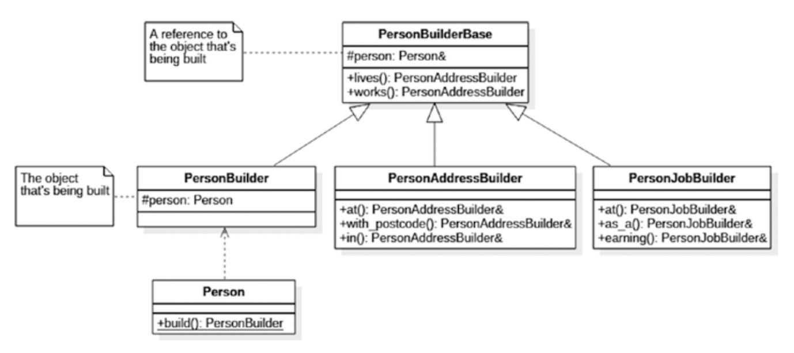

### 建造者模式

建造者模式（`Builder`）涉及到复杂对象的创建，即不能在单行构造函数调用中构建的对象。这些类型的对象本身可能由其他对象组成，可能涉及不太明显的逻辑，需要一个专门用于对象构造的单独组件。

我认为值得事先注意的是，虽然我说建造者适用于复杂的对象的创建，但我们将看一个相当简单的示例。这样做纯粹是为了空间优化，这样领域逻辑的复杂性就不会影响读者欣赏模式实现的能力。

#### 场景

让我们想象一下，我们正在构建一个呈现`web`页面的组件。首先，我们将输出一个简单的无序列表，其中有两个`item`，其中包含单词`hello`和`world`。一个非常简单的实现如下所示:

```c++
string words[] = { "hello", "world" };
ostringstream oss;
oss << "<ul>";
for (auto w : words)
oss << " <li>" << w << "</li>";
oss << "</ul>";
printf(oss.str().c_str())
```

这实际上给了我们想要的东西，但是这种方法不是很灵活。如何将项目符号列表改为编号列表?在创建了列表之后，我们如何添加另一个`item`?显然，在我们这个死板的计划中，这是不可能的。


因此，我们可以通过`OOP`的方法定义一个`HtmlElement`类来存储关于每个`tag`的信息:


```c++
struct HtmlElement {
  string name;
  string text;
  vector<HtmlElement> elements;
  HtmlElement() {}
  HtmlElement(const string& name, const string& text)
      : name(name), text(text) {}

  string str(int indent = 0) const {
    // pretty-print the contents
  }
};
```

有了这种方法，我们现在可以以一种更合理的方式创建我们的列表:

```c++
string words[] = {"hello", "world"};
HtmlElement list{"ul", ""};
for (auto w : words) list.elements.emplace_back{HtmlElement{"li", w}};
printf(list.str().c_str());
```

这做得很好，并为我们提供了一个更可控的、`OOP`驱动的条目列表表示。但是构建每个`HtmlElement`的过程不是很方便，我们可以通过实现建造者模式来改进它。

#### 简单建造者

建造者模式只是试图将对象的分段构造放到一个单独的类中。我们的第一次尝试可能会产生这样的结果：

```c++
struct HtmlBuilder {
  HtmlElement root;

  HtmlBuilder(string root_name) { root.name = root_name; }

  void add_child(string child_name, string child_text) {
    HtmlElement e{child_name, child_text};
    root.elements.emplace_back(e);
  }

  string str() { return root.str(); }
};
```

这是一个用于构建`HTML`元素的专用组件。`add_child()`方法是用来向当前元素添加额外的子元素的方法，每个子元素都是一个名称-文本对。它可以如下使用:

```c++
HtmlBuilder builder{ "ul" };
builder.add_child("li", "hello");
builder.add_child("li", "world");
cout << builder.str() << endl;
```

你会注意到，此时`add_child()`函数是返回空值的。我们可以使用返回值做许多事情，但返回值最常见的用途之一是帮助我们构建流畅的接口。


#### 流畅的建造者

让我们将`add_child()`的定义改为如下:

```c++
HtmlBuilder& add_child(string child_name, string child_text) {
  HtmlElement e{child_name, child_text};
  root.elements.emplace_back(e);
  return *this;
}
```

通过返回对建造者本身的引用，现在可以在建造者进行链式调用。这就是所谓的流畅接口(`fluent interface`):

```c++
HtmlBuilder builder{ "ul" };
builder.add_child("li", "hello").add_child("li", "world");
cout << builder.str() << endl;
```

引用或指针的选择完全取决于你。如果你想用`->`操作符，可以像这样定义`add_child()`

```c++
HtmlBuilder* add_child(string child_name, string child_text) {
  HtmlElement e{child_name, child_text};
  root.elements.emplace_back(e);
  return this;
}
```

像这样使用：

```c++
HtmlBuilder builder = new HtmlBuilder{ "ul" };
builder->add_child("li", "hello")->add_child("li", "world");
cout << builder->str() << endl;
```

#### 交流意图

我们为`HTML`元素实现了一个专用的建造者，但是我们类的用户如何知道如何使用它呢?一种想法是，只要他们构造对象，就强制他们使用建造者。你需要这样做:

```c++
struct HtmlElement {
  string name;
  string text;
  vector<HtmlElement> elements;
  const size_t indent_size = 2;
  static unique_ptr<HtmlBuilder> build(const string& root_name) {
    return make_unique<HtmlBuilder>(root_name);
  }

 protected:  // hide all constructors
  HtmlElement() {}
  HtmlElement(const string& name, const string& text)
      : name{name}, text{text} {}
};
```

我们的做法是双管齐下。首先，我们隐藏了所有的构造函数，因此它们不再可用。但是，我们已经创建了一个工厂方法(这是我们将在后面讨论的设计模式)，用于直接从`HtmlElement`创建一个建造者。它也是一个静态方法。下面是如何使用它：

```c++
auto builder = HtmlElement::build("ul"); 
(*builder).add_child("li", "hello").add_child("li", "world");
cout << builder.str() << endl;
```

但是不要忘记，我们的最终目标是构建一个`HtmlElement`，而不仅仅是它的建造者!因此，锦上添花的可能是建造者上的 `operator HtmlElement`的实现，以产生最终值:

```c++
struct HtmlBuilder {
  operator HtmlElement() const { return root; }
  HtmlElement root;
  // other operations omitted
};
```

前面的一个变体是返回std::move(root)，但是否这样做实际上取决于你自己。不管怎样，运算符的添加允许我们写下以下内容:

```c++
HtmlElement e = *(HtmlElement::build("ul"))
                     .add_child("li", "hello")
                     .add_child("li", "world");
cout << e.str() << endl;
```

遗憾的是，没有办法明确地告诉其他用户以这种方式使用API。对构造函数的限制加上静态`build()`函数的存在，希望用户能够使用构造函数，但是，除了操作符之外，还可以向`HtmlBuilder`本身添加一个相应的`build()`函数:

```c++
HtmlElement HtmlBuilder::build() const {
  return root;  // again, std::move possible here
}
```
#### Groovy风格的建造者

这个例子稍微偏离了专用建造者，因为实际上没有看到任何建造者。它只是一种对象构造的替代方法。

诸如`Groovy、Kotlin`等编程语言都试图通过支持使构建过程更好的语法结构来展示它们在构建`DSL`方面有多么出色。但是为什么c++应该有所不同呢?多亏了初始化列表，我们可以使用普通的类有效地构建一个兼容`HTML`的`DSL`

首先，我们将定义一个`HTML`标签:

```c++
struct Tag {
  std::string name;
  std::string text;
  std::vector<Tag> children;
  std::vector<std::pair<std::string, std::string>> attributes;
  friend std::ostream& operator<<(std::ostream& os, const Tag& tag) {
    // implementation omitted
  }
};
```

到目前为止，我们已经有了一个可以存储其名称、文本、子标签(内部标签)，甚至`HTML`属性的标签。我们也有一些打印代码，但在这里显示太无聊了。

现在我们可以给它提供两个在保护字段的构造函数(因为我们不希望任何人直接实例化它)。我们之前的实验告诉我们，我们至少有两种情况：

- 一个由名称和文本初始化的标签(例如，一个列表项)
- 一个由名称和一组子元素初始化的标签

第二种情况更有趣;我们将使用一个`std::vector`类型的形参

```c++
struct Tag {
  ... protected : Tag(const std::string& name, const std::string& text)
      : name{name}, text{text} {}
  Tag(const std::string& name, const std::vector<Tag>& children)
      : name{name}, children{children} {}
};
```

现在，我们可以继承这个标签类，但仅限于有效的`HTML`标签(因此限制了我们的DSL)。让我们定义两个标签:一个用于段落，另一个用于图像

```c++
struct P : Tag {
  explicit P(const std::string& text) : Tag{"p", text} {}

  P(std::initializer_list<Tag> children) : Tag("p", children) {}
};
struct IMG : Tag {
  explicit IMG(const std::string& url) : Tag{"img", ""} {
    attributes.emplace_back({"src", url});
  }
};
```

前面的构造函数进一步约束了我们的API。根据前面的构造函数，段落只能包含文本或一组子元素。另一方面，图像不能包含其他标记，但必须具有一个名为img的属性，该属性具有提供的地址。

现在，由于统一初始化和派生的所有构造函数，我们可以写以下内容：

```c++
std::cout << P{IMG{"http://pokemon.com/pikachu.png"}} << std::endl;
```

这不是很棒吗?我们已经为段落和图像构建了一个小型`DSL`，这个模型可以很容易地扩展以支持其他标签。并且没有看到`add_child()`调用。


#### 组合建造者

我们将通过一个使用多个建造者构建单个对象的例子来结束对建造者的讨论。假设我们决定记录关于一个人的一些信息：

```c++
class Person {
  // address
  std::string street_address, post_code, city;

  // employment
  std::string company_name, position;
  int annual_income = 0;
  Person() {}
};
```

`Person`的成员变量中包含:地址信息和就业信息。如果我们想为这两类信息提供单独的建造者，我们如何提供最方便的API呢?为此，我们将构建一个复合建造者。这个构造不是简单的，所以请注意，即使我们想为就业和地址信息创建不同的建造者，我们也会生成不少于四个不同的类。

我在本书中选择完全避免使用 `UML`，但这是类图有意义的一种情况，所以这是我们实际要构建的内容：



我们将调用第一个类 `PersonBuilderBase`：

```c++
class PersonBuilderBase {
 protected:
  Person& person;
  explicit PersonBuilderBase(Person& person) : person{person} {}

 public:
  operator Person() { return std::move(person); }
  // builder facets
  PersonAddressBuilder lives() const;
  PersonJobBuilder works() const;
};
```

这比我们之前的简单 `Builder` 要复杂得多，所以让我们依次讨论每个成员。

- 引用 `person` 是对正在构建的对象的引用。这可能看起来很奇怪，但它是为子建造者特意完成的。请注意，此类中不存在 `Person` 的物理存储。这很关键！根类只持有一个引用，而不是构造的对象。
- 引用拷贝构造函数受到保护，因此只有继承者（`PersonAddressBuilder` 和 `PersonJobBuilder`）可以使用它。
- 运算符 `Person` 是我们之前使用过的一个技巧。 假设 `Person` 具有正确定义的移动构造函数 - `ReSharper` 轻松生成一个。
- `life()` 和 `works()` 是返回建造者方面的函数：那些分别初始化地址和就业信息的子建造者。

现在，上一个基类中唯一缺少的是正在构造的实际对象。它在哪里？嗯，它实际上存储在我们称之为`PersonBuilder`的继承者中。这是我们希望人们实际使用的类：

```c++
class PersonBuilder : public PersonBuilderBase {
  Person p;  // object being built
 public:
  PersonBuilder() : PersonBuilderBase{p} {}
};
```

所以这是构建对象实际构建的地方。这个类不是要继承的：它只是一个实用程序，可以让我们启动设置建造者的过程。[1]

注释1： GitHub 上的@CodedByATool 建议采用这种将层次结构分成两个单独的基类以避免重复 Person 实例的方法 - 感谢你的想法！

为了找出我们最终使用不同的公共和受保护构造函数的确切原因，让我们看看其中一个子创建者的实现：

```c++
class PersonAddressBuilder : public PersonBuilderBase {
  typedef PersonAddressBuilder self;

 public:
  explicit PersonAddressBuilder(Person& person) : PersonBuilderBase{person} {}
  self& at(std::string street_address) {
    person.street_address = street_address;
    return *this;
  }
  self& with_postcode(std::string post_code){...} self& in(std::string city) {
    ...
  }
};
```

如你所见，`PersonAddressBuilder` 提供了流畅的界面
用于建立一个人的地址。请注意，它实际上是从 `PersonBuilderBase` 继承的（意味着它已经获得了 `life()` 和 `works()` 成员函数）并调用了基构造函数，传递了一个引用。

不过它并没有从 PersonBuilder 继承——如果是这样，我们会创建太多的 Person 实例，实际上，我们只需要一个。

你可以猜到，`PersonJobBuilder` 是用相同的方式实现的。这两个类以及 `PersonBuilder` 都在 `Person` 内部声明为友元类，以便能够访问其私有成员。

现在，你一直在等待的那一刻：这些建设者在行动的例子:

```c++
Person p = Person::create()
               .lives()
               .at("123 London Road")
               .with_postcode("SW1 1GB")
               .in("London")
               .works()
               .at("PragmaSoft")
               .as_a("Consultant")
               .earning(10e6);
```

你能看到这里发生了什么吗？我们使用 `create()` 函数为我们自己创建一个创建者，并使用 `life()` 函数为我们获取一个 `PersonAddressBuilder`，但是一旦我们完成了地址信息的初始化，我们只需调用 `works()` 并切换到使用 `PersonJobBuilder`。

当我们完成构建过程时，我们使用相同的技巧像以前一样将对象构建为 `Person`。请注意，一旦完成，建造者将无法使用，因为我们使用 `std::move()` 移动了 `Person`。

#### 总结

建造者模式的目标是定义一个完全用于分段构造复杂对象或一组对象的组件。我们已经观察到建造者的以下关键特征：

- 建造者可以拥有流畅的接口，可用于使用单个调用链进行复杂的构造。为了支持这个，构造函数应该返回`this`或`*this`。
- 为了强制`API`的用户使用一个构造器，我们可以使目标对象的构造器不可访问，然后定义一个静态的`create()`函数来返回这个构造器。
- 通过定义适当的操作符，可以将构造器强制转换为对象本身。
- 多亏了统一的初始化器语法，`groovy`风格的建造者在c++中是可能的。这种方法非常普遍，并且允许创建不同的领域特定语言(DSLs)。
- 单个建造者接口可以公开多个子建造者。通过巧妙地使用继承和流畅接口，可以轻松地从一个建造者跳转到另一个。

重申一下我已经提到过的内容，当对象的构造是一个重要的过程时，使用建造者模式是有意义的。由有限数量的合理命名的构造函数参数明确构造的简单对象可能应该使用构造函数(或依赖注入)，而不需要这样的建造者。